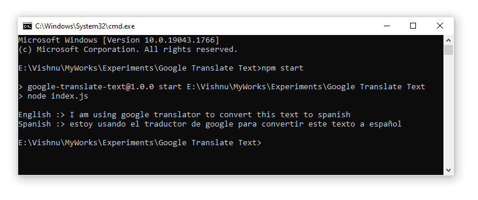

# Google Cloud Translate Demo

#### Create a project on google cloud
- Navigate to https://console.developers.google.com and login using your google credentials.
- Create a new Project. Once the project is created, you'll be navigated to the app dashboard screen and click on the Cloud Translation API.
- On the Cloud Translation API page just click on enable button
- Click on the create credentials button to create your API key
- Click on the API Key to create an API Key
- Choose a name for your api key or keep it default and click on create API key keeping all other options as default
- Now, you can copy your API key for your nodejs project.

#### Add node sdk for translator
- Install the google-translate package from npm using the following command,

```
npm install
```
or					
```
npm install google-translate 										
```										
- Create a file named `translate.js` and add the following code to it. Don't forget to replace the api key with your actual api key.
										
```
var api = "YOUR_GOOGLE_TRANSLATOR_KEY_HERE";
var googleTranslate = require('google-translate')(api);

var text = 'I am using google translator to convert this text to spanish'
console.log("English :>",text);
googleTranslate.translate(text, 'es', function(err, translation) {
  console.log("Spanish :>",translation.translatedText);
});
```

#### Run the app
We can run the code using the following command and we will get the output shown below:
```
node translate.js
```
